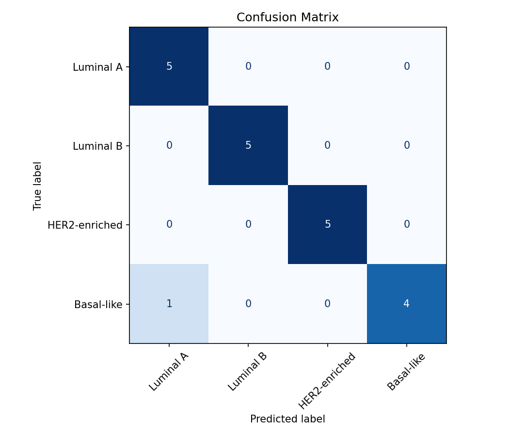

# Cancer Subtype Classification Using Gene Expression Data

A healthcare data science portfolio project demonstrating an end-to-end machine learning workflow for classifying breast cancer subtype labels from gene-expression-style tabular data.

This repository currently uses **synthetic demo data only**. It is designed to show software engineering, data preparation, modeling, evaluation, and Streamlit deployment patterns in a shareable project. It is not a clinical diagnostic tool.

## Project Overview

The project includes a reproducible pipeline for:

- loading gene expression data and subtype labels from CSV files
- aligning samples and labels by `sample_id`
- preprocessing numeric gene expression features
- training baseline classification models
- evaluating predictions with standard classification metrics
- saving model and evaluation artifacts
- serving a simple Streamlit demo app for inference

The current demo predicts one of four synthetic subtype labels:

- Luminal A
- Luminal B
- HER2-enriched
- Basal-like

## Motivation

Gene expression data is commonly represented as a high-dimensional matrix where rows are biological samples and columns are genes or gene-derived features. This project shows how that kind of data can be handled in a clean, reproducible machine learning workflow.

For portfolio review, the focus is on practical implementation:

- modular Python code
- scikit-learn pipelines
- clear validation errors
- reproducible synthetic data generation
- saved model artifacts
- simple user-facing app

## Data

The included data in `data/sample_input.csv` is synthetic demo data generated by this project. It contains:

- `sample_id`
- gene columns named `gene_001`, `gene_002`, etc.
- synthetic subtype labels

No real patient data is included in this repository.

Real TCGA BRCA data could be integrated through the same pipeline by replacing the synthetic CSV inputs with approved, properly normalized expression data and corresponding subtype labels. That would require appropriate data access, preprocessing, quality control, and validation steps before any scientific interpretation.

## Methods

The demo workflow uses:

- synthetic gene-expression-style data generation
- sample/label alignment by `sample_id`
- missing value imputation
- variance-based feature filtering
- standard scaling
- stratified train/test split
- Logistic Regression baseline
- Random Forest classifier
- accuracy and macro F1 evaluation
- classification report
- confusion matrix visualization

The saved model artifact is a complete scikit-learn pipeline containing both preprocessing and the selected classifier, so it can be loaded directly for inference.

## Repository Structure

```text
.
├── app.py                              # Streamlit demo app
├── data/
│   └── sample_input.csv                # Synthetic demo input data
├── models/
│   └── best_model.joblib               # Saved demo model pipeline
├── notebooks/
│   └── 01_demo_modeling_workflow.ipynb # Exploratory demo workflow
├── outputs/
│   ├── confusion_matrix.png            # Demo confusion matrix
│   ├── metrics.json                    # Demo metrics export
│   └── app_screenshot.png              # App screenshot, if included
├── src/
│   ├── data.py                         # Data loading and synthetic data utilities
│   ├── evaluate.py                     # Metrics and plotting utilities
│   ├── inference.py                    # Model loading and prediction helpers
│   ├── preprocessing.py                # scikit-learn preprocessing pipeline
│   └── train.py                        # Training CLI
└── requirements.txt
```

## How to Run Locally

Create and activate an environment, then install dependencies:

```bash
pip install -r requirements.txt
```

If using the local conda environment for this project:

```bash
conda activate myenv
```

Train the synthetic demo models and regenerate artifacts:

```bash
python src/train.py --demo
```

This creates or updates:

- `models/best_model.joblib`
- `outputs/metrics.json`
- `outputs/confusion_matrix.png`

## Demo App

Run the Streamlit app:

```bash
streamlit run app.py
```

The app allows a reviewer to:

- use a bundled synthetic demo sample from `data/sample_input.csv`
- upload a CSV file with the required gene columns
- view predicted subtype labels
- view class probabilities
- inspect a probability bar chart

If the model artifact is missing, the app shows the command needed to train it:

```bash
python src/train.py --demo
```

## Example Outputs

The training command writes example demo outputs to `outputs/`:

- `metrics.json`: accuracy, macro F1, and classification report for the synthetic held-out test set
- `confusion_matrix.png`: confusion matrix for the synthetic held-out test set

These outputs are useful for confirming that the workflow runs end to end. Because the included dataset is synthetic, the demo metrics should not be interpreted as evidence of clinical performance.

## Screenshots

Streamlit app screenshot:


Confusion matrix output:



## Notebook

The notebook at `notebooks/01_demo_modeling_workflow.ipynb` provides a clean exploratory walkthrough for interview review. It covers:

- synthetic demo data generation
- class distribution
- preprocessing and model training
- accuracy and macro F1
- confusion matrix display
- limitations and real-data considerations

## Limitations

- The included data is synthetic and simplified.
- Synthetic data does not capture real biological variability, batch effects, missingness patterns, or clinical context.
- The current models are baseline classifiers intended to demonstrate workflow structure.
- Demo metrics are not clinical performance estimates.
- No real TCGA BRCA patient data is included.
- This repository does not perform biomarker discovery, treatment recommendation, diagnosis, or prognosis.

## Future Improvements

Potential next steps:

- integrate approved TCGA BRCA expression and subtype label data
- add data normalization and quality-control steps appropriate for real expression data
- add cross-validation and stronger model selection
- track experiments and model metadata
- add unit tests for data validation, preprocessing, and inference
- improve app upload guidance with a downloadable CSV template
- add model interpretability views for reviewer inspection, without making clinical claims

## Disclaimer

This project is for portfolio and educational demonstration only. The included demo data is synthetic and is not intended for clinical use, diagnosis, prognosis, treatment selection, or medical decision-making.
